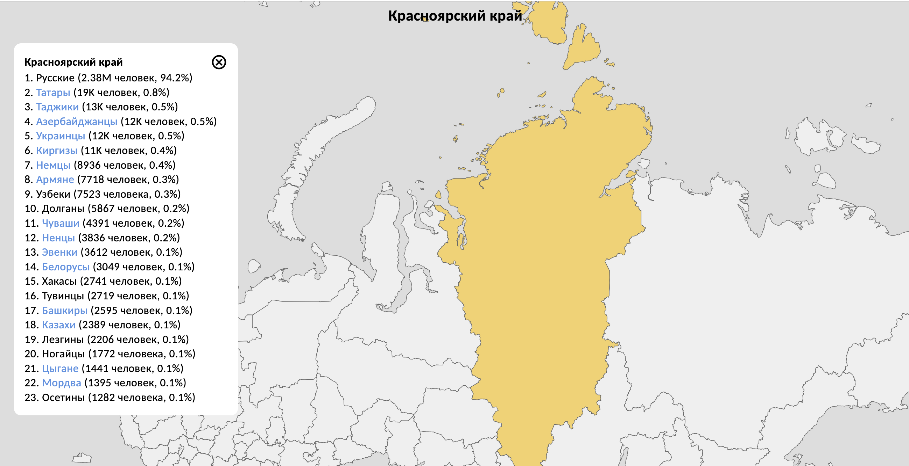
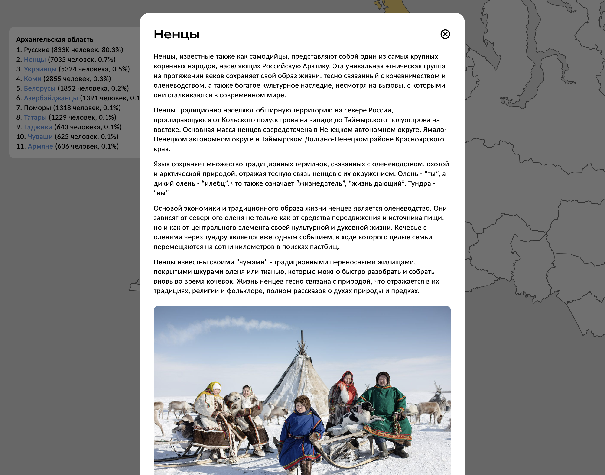

# Интерактивная карта народов России

Создана в рамках проекта по Истории России (НИУ ВШЭ)

Результат можно посмотреть по адресу:
<a href="https://map.vvscode.ru">map.vvscode.ru</a>

> Веселов Владислав (<a href="https://github.com/vvs-code">@vvs-code</a>) \
> Максим Кирилюк (<a href="https://github.com/werserk">@werserk</a>) \
> Никита Романов (<a href="https://github.com/KARTASAR">@KARTASAR</a>)

## Стек

Веб-приложение написано на React + TypeScript, собирается
через Webpack и размещается на веб-сервере Apache с настроенным PHP.
Для стилей используется препроцессор LESS. Данные хранятся в формате JSON

## Визуализация

